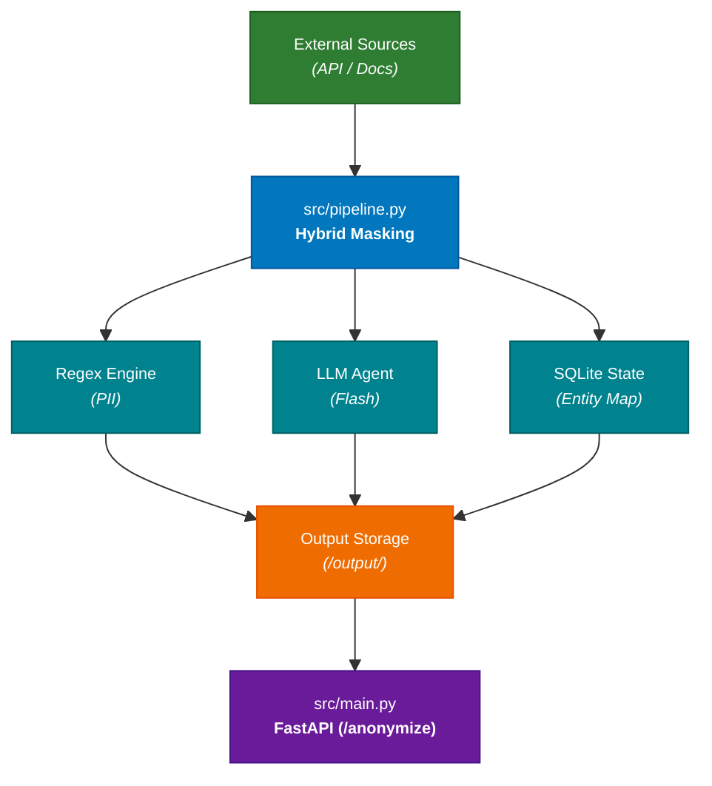

```mermaid
graph TD
    %% Nodos compactos
    Start["External Sources<br><i>(API / Docs)</i>"]
    Pipeline["src/pipeline.py<br><b>Hybrid Masking</b>"]
    
    Regex["Regex Engine<br><i>(PII)</i>"]
    LLM["LLM Agent<br><i>(Flash)</i>"]
    SQLite["SQLite State<br><i>(Entity Map)</i>"]
    
    Storage["Output Storage<br><i>(/output/)</i>"]
    End["src/main.py<br><b>FastAPI (/anonymize)</b>"]

    %% Conexiones
    Start --> Pipeline
    Pipeline --> Regex
    Pipeline --> LLM
    Pipeline --> SQLite
    Regex --> Storage
    LLM --> Storage
    SQLite --> Storage
    Storage --> End

    %% Estilos compactos
    classDef startStyle fill:#2e7d32,stroke:#1b5e20,stroke-width:1px,color:#fff,font-size:11px;
    classDef processStyle fill:#0277bd,stroke:#01579b,stroke-width:1px,color:#fff,font-size:11px;
    classDef componentStyle fill:#00838f,stroke:#006064,stroke-width:1px,color:#fff,font-size:11px;
    classDef storageStyle fill:#ef6c00,stroke:#e65100,stroke-width:1px,color:#fff,font-size:11px;
    classDef endStyle fill:#6a1b9a,stroke:#4a148c,stroke-width:1px,color:#fff,font-size:11px;

    class Start startStyle;
    class Pipeline processStyle;
    class Regex,LLM,SQLite componentStyle;
    class Storage storageStyle;
    class End endStyle;
```